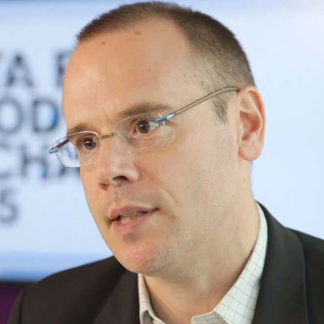
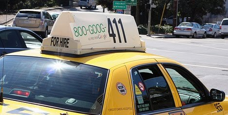
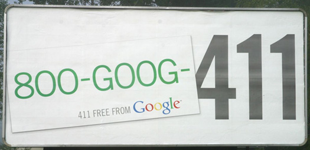
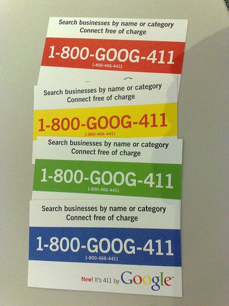

## About Me

* [LinkedIn](https://www.linkedin.com/in/sahuguet/)
* [Twitter](https://twitter.com/sahuguet)
* [Medium](https://medium.com/@sahuguet)
* [Github](https://github.com/sahuguet)
* most recent CV
* TORBI LLC

## Products I have launched
### GOOG-411
 |  | 

### One Today

## Social Impact and For-Good Projects
### Data for Good Exchange

## Data Science
* Are We There Yet? challenges for location-aware data science. NYS GIS Symposium, October 2016
<iframe src="https://docs.google.com/presentation/d/e/2PACX-1vRiEaeEsiJLQJbQ8P-a3K0RdOTt5Ul2maz4AFZbmv9jPQU61UrxS4JP44kEexUW0jLV7ArT9hWXLdTj/embed?start=false&loop=false&delayms=3000" frameborder="0" width="480" height="299" allowfullscreen="true" mozallowfullscreen="true" webkitallowfullscreen="true"></iframe>

* Small Data Metadata. ["Data, Responsibly" Dagstuhl seminar, July 2016](http://www.dagstuhl.de/16291/)
<iframe src="https://docs.google.com/presentation/d/e/2PACX-1vQe_lkV9p_TIvparoxFYKZXaczcgXHn8TY1sfrbCCyGd-GP7RGlK6MyrF1Hn0zUetoRJVWBErwZ5r6i/embed?start=false&loop=false&delayms=3000" frameborder="0" width="480" height="299" allowfullscreen="true" mozallowfullscreen="true" webkitallowfullscreen="true"></iframe>

* Data Science: challenges & opportunities. Information session at Ecole Polytechnique, December 2014.
<iframe src="https://docs.google.com/presentation/d/e/2PACX-1vR_XUWwFoEBVYHAylKyyTw5gP0VYZ161azd6-BcIZfPezNRLbmrPTV1ujI04ZuLDIe-hDos1khMbcU4/embed?start=false&loop=false&delayms=3000" frameborder="0" width="480" height="299" allowfullscreen="true" mozallowfullscreen="true" webkitallowfullscreen="true"></iframe>

### NYU-AD hackathon
* Ideation deck (2015)
<iframe src="https://docs.google.com/presentation/d/e/2PACX-1vSqYGUMmGZuv9EUw6SbkjzPJE_oxqFEnyoBNsqGJCL_5WMkoYW6SZ5arTFoG6NnsvRird1-CEFThs_B/embed?start=false&loop=false&delayms=3000" frameborder="0" width="480" height="299" allowfullscreen="true" mozallowfullscreen="true" webkitallowfullscreen="true"></iframe>

### Debugging Politics hackathon
Over the course of a long week-end, we built Influenza, a tool to find "patterns of influence" in politics: (1) we create a graph of the US political system using open data and (2) we query the graph to find "bugs".

* [Debugging Politics: a software engineering take on it](https://medium.com/cornell-tech/debugging-politics-a-software-engineering-take-on-it-ec7d6e057d4c) (January 2017)
* [Debugging 'Debug Politics'](https://medium.com/cornell-tech/debugging-debug-politics-afd198f57778) (January 2017)
<iframe src="https://docs.google.com/presentation/d/e/2PACX-1vRt2gfLp6DKUDTBq_zhXDZj5ZB6ntMZFrhHBnHbr_yUKbeP9cpOAbHZLZFQ3sLEUSofNw4-1ySCU4hM/embed?start=false&loop=false&delayms=3000" frameborder="0" width="480" height="299" allowfullscreen="true" mozallowfullscreen="true" webkitallowfullscreen="true"></iframe>

## Nesta Tech innovation series (#Tech4Labs)
I was asked by [Nesta](https://www.nesta.org.uk/) to contribute a few pieces about tech innovation.
* [Forms: co-creation's unsung heroes](http://www.nesta.org.uk/blog/tech4labs-issue-1) (part 1, Dec 2014)
* [GitHub: the Swiss army knife of civic innovation?](https://medium.com/@sahuguet/github-the-swiss-army-knife-of-civic-innovation-d2ba67288abb) (part 2, March 2015)
* [Digital tools for participatory democracy](https://www.nesta.org.uk/blog/tech4labs-issue-3-digital-tools-for-participatory-democracy/) (part 3, March 2015)
* ['Canvassing' the value proposition of your public lab project](https://www.nesta.org.uk/blog/tech4labs-issue-4-canvassing-the-value-proposition-of-your-public-lab-project/) (part 4, April 2015)
* [Tech tools and tips to help your public innovation lab generate ideas](https://www.nesta.org.uk/blog/tech-tools-and-tips-to-help-your-public-innovation-lab-generate-ideas/) (part 5, April 2015)
* I did not write part 6.
* [Development and testing for public labs: “Fake it before you make it”](https://www.nesta.org.uk/blog/development-and-testing-for-public-labs-fake-it-before-you-make-it/) (part 7, July 2015)
* [Ready, set, launch: implementation and delivery for your lab’s project](https://www.nesta.org.uk/blog/ready-set-launch-implementation-and-delivery-for-your-labs-project/) (part 8, July 2015)
* [Scaling and growing your innovation lab’s project](https://www.nesta.org.uk/blog/scaling-and-growing-your-innovation-labs-project/) (part 9, September 2015)

## Urban Tech
* Circular Data for a Circular City: Value Propositions for Mobility, in [Circular City Research Journal](https://newlab.com/wp-content/uploads/2019/03/for-posting-to-web.pdf), March 2019.

* Smarter NYC, how City Agencies innovate, edited by André Corrêa d'Almeida. Chapter 11 on Vision Zero. Columbia University Press, August 2018.

* [My Three Wishes for the Sidewalk Labs' Genie](https://medium.com/@sahuguet/my-three-wishes-for-the-sidewalk-labs-genie-5d1adc798c3d), March 2016.

## The Foundry @ Cornell Tech
### WTF Digest
From 10/2016 to 12/2018, I publsihed a weekly digest (the Foundry Weekly Tech Fix or WTF).
The digest is a curated list of articles, posts, etc. that I find interesting.
The digest is articulated around the following themes:
* Department of Digital Addictions — 🎮 💉
* Department of Smarter Cities — 💡🏙
* Department of Shameless Plugs — 🤑 🔌
* Department of Silver Linings — 🌈🎆
* Department of “we” the people — 🙋👨🏽‍💼👷🏿👩🏼‍🔬
* Department of worthy quotes — 🎬 📖

The entire archive can be found on [Medium](https://medium.com/tag/foundry-digest/archive).

## Innovation
* From Research to products (and vice versa). February 2016
<iframe src="https://docs.google.com/presentation/d/e/2PACX-1vQ8VYJqnKrSW8dSBNznpyCK33pkKQulz3g4AfqIZHol1UqEaG899wGMi_WBAu5mWYomGhEliOH6gE_N/embed?start=false&loop=false&delayms=3000" frameborder="0" width="480" height="299" allowfullscreen="true" mozallowfullscreen="true" webkitallowfullscreen="true"></iframe>
* De Innovatione Rerum. From EDF & Columbia Universtity. Otober 2014.
<iframe src="https://docs.google.com/presentation/d/e/2PACX-1vQAIfZOxisNo3FBjTAgv5ySvgi6g5SGk1qW3l7Dbv1NjO0rAylAchP7DhO209LF9twuJqCexL71ZMR_/embed?start=false&loop=false&delayms=3000" frameborder="0" width="480" height="389" allowfullscreen="true" mozallowfullscreen="true" webkitallowfullscreen="true"></iframe>

## Teaching
* PM Bootcamp, a guest lecture about product management for new Cornell Tech MBA students. Spring 2017.
<iframe src="https://docs.google.com/presentation/d/e/2PACX-1vT-0jJQ7K7zH6u9XiGRxvHxgKt1tO-EcpxyszmM-K57q5VY2PIvXBasDJlpp-S3_ZU__H4K2fW8Cb_i/embed?start=false&loop=false&delayms=3000" frameborder="0" width="480" height="299" allowfullscreen="true" mozallowfullscreen="true" webkitallowfullscreen="true"></iframe>

* Hosting 101, guest lecture for the Building Startup Systems class (CS-5356). Fall 2016.
<iframe src="https://docs.google.com/presentation/d/e/2PACX-1vQiwlM8wOq-OLt6IBLcKh997j0Wzu3HmcEhgWMssI1aAZYXAVR7Kcx4iTujZA8C-LiP7-uhweDMZjUc/embed?start=false&loop=false&delayms=3000" frameborder="0" width="480" height="299" allowfullscreen="true" mozallowfullscreen="true" webkitallowfullscreen="true"></iframe>

* Tech for non-Tech, 2 guest lectures for Professor Rafael Pass. Fall 2016.
<iframe src="https://docs.google.com/presentation/d/e/2PACX-1vS7i5KLz8ANBM7mJi4BbhPDeWuSgYUh_v4yc3GxF_yTqV6poeHYUHCXCK22weWo1-YNP4IozK1kS04E/embed?start=false&loop=false&delayms=3000" frameborder="0" width="480" height="299" allowfullscreen="true" mozallowfullscreen="true" webkitallowfullscreen="true"></iframe>
<iframe src="https://docs.google.com/presentation/d/e/2PACX-1vRgN9rDzaUNRp1PLzYxSqj0uOg3VB4narzuzgZc0mGldbJ6uOYOiP7WIEQ2KF4l1tcArT38veASaPGJ/embed?start=false&loop=false&delayms=3000" frameborder="0" width="480" height="299" allowfullscreen="true" mozallowfullscreen="true" webkitallowfullscreen="true"></iframe>

* "Design Thinking", a guest lecture for the Smart Cities course offered by Cornell Baker Program in Real Estate. Fall 2018.
<iframe src="https://docs.google.com/presentation/d/e/2PACX-1vS82YG6b9gsZ0WBHUWmRKxHzmfWRaMbsnZIaOZXEkTFYHlZQ1OhxVRo99yGf1lK4S_iexrdyfNgy-hJ/embed?start=false&loop=false&delayms=3000" frameborder="0" width="480" height="299" allowfullscreen="true" mozallowfullscreen="true" webkitallowfullscreen="true"></iframe>

* "Startup Systems", a guest lecture for "Tech for Business" class taught by Professor Rafael Pass. Fall 2015.

* "Fake it before you make it", a guest lecture for "Product Management" class (CS 5093) taught by Professor Greg Pass. Fall 2015.
<iframe src="https://docs.google.com/presentation/d/e/2PACX-1vSGKKG6JnC4QlnXVeqf6WtcRe-KDUNcdlO6xsQLXJVY8TXIEAW0e32YlXw6jwofOLMtm7ZkYWQmgUOC/embed?start=false&loop=false&delayms=3000" frameborder="0" width="480" height="299" allowfullscreen="true" mozallowfullscreen="true" webkitallowfullscreen="true"></iframe>

* "Civic Tech for Local Legislatures and Legislators", with Ben Kallos. Coaching program from NYU GovLab Academy, Spring 2015.

* "Mobile Civic Apps", a guest lecture for Beth's Noveck class at NYU Wagner. Spring 2013.
<iframe src="https://docs.google.com/presentation/d/e/2PACX-1vS5jUdYlMjX7FoWHkNiH1ZJfte0-clXXfZz8RXKOYPVsJYBU3DVraCINwxa7pDrcac6fNWr0ENueGUP/embed?start=false&loop=false&delayms=3000" frameborder="0" width="480" height="389" allowfullscreen="true" mozallowfullscreen="true" webkitallowfullscreen="true"></iframe>

## Casual Writings, Blogging
I try to write short pieces about topics of interest, conferences I have attended or recent projects I have been working on

### About Products
* [Being Juror #8](https://medium.com/cornell-tech/being-juror-8-part-1-the-tech-part-69b8914de9dd), November 2016.

### About AI
* [Alexa, what's the fuss with voice services?](https://medium.com/cornell-tech/alexa-whats-the-fuss-with-voice-services-59d749e94256) (May 2017)
* [Personal Views on the Future of Artificial Intelligence](https://medium.com/machine-intelligence-report/personal-views-on-the-future-of-artificial-intelligence-509c5db276fc) (January 2016, after attending the NYU Symposium on the Future of AI)

### About the Blockchain
* Somebody said "Blockchain"?. A guest lecture for high-school students attending a programming contest at Cornell Tech. Spring 2018.
<iframe src="https://docs.google.com/presentation/d/e/2PACX-1vS8MihH3jx876Pegf0rdzmLSQjnpYmm_RDmsDvDO5xtny2d5JihjQmJ8-fUHKP3Y9g_WurjVY1bmAk2/embed?start=false&loop=false&delayms=3000" frameborder="0" width="480" height="299" allowfullscreen="true" mozallowfullscreen="true" webkitallowfullscreen="true"></iframe>
* [Everything* You Always Wanted to Know About ICOs But Were Afraid to ask](https://medium.com/cornell-tech/everything-you-always-wanted-to-know-about-icos-but-were-afraid-to-ask-b9728dc38b81) (October 2017, > 5.1K views on Medium)
* [Everything* You Always Wanted to Know About the Blockchain But Were Afraid to ask](http://52.5.205.245/everything-you-always-wanted-to-know-about-the-blockchain-but-were-afraid-to-ask/) (June 2016)

### Other Projects
* [Preventing Opioid Addiction Using Tech](https://medium.com/cornell-tech/preventing-opioid-addiction-using-tech-f6bb21faf3f)
