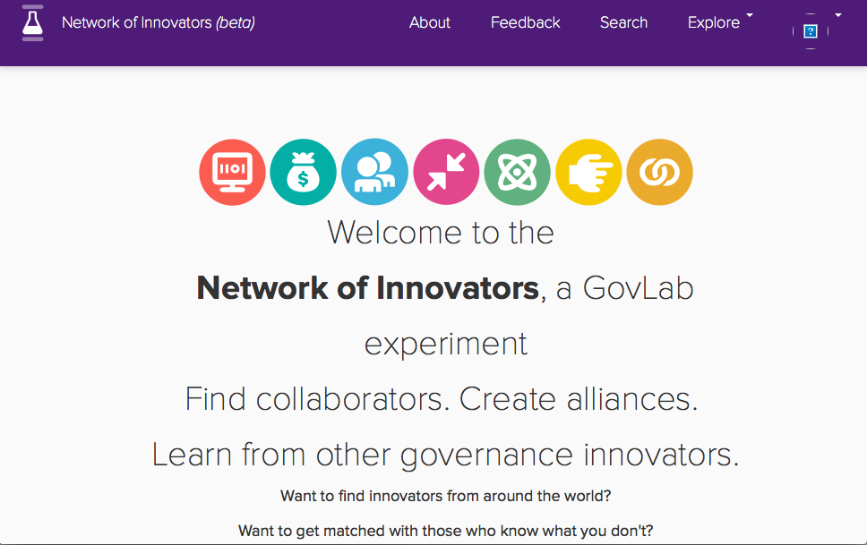
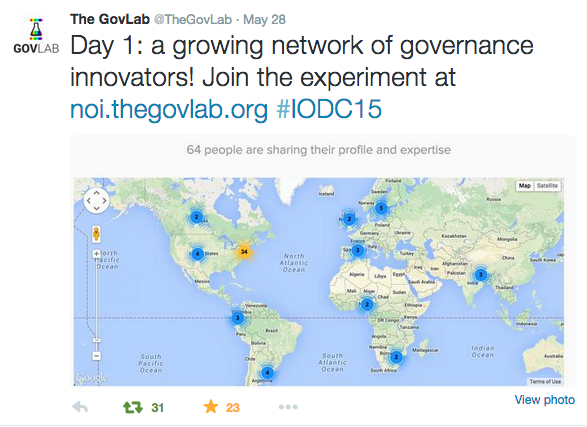

# About Me

My passion is to invent, architect and build products that leverage technology to solve mean- ingful problems and have a large social impact. I aim at empowering people and organizations to be more productive and collaborative through innovation.

My areas of expertise include data – big, small, open, geographic – management and anal- ysis, architecture of complex systems, product design and research & development.

I am currently working for the Jacobs Institute at Cornell Tech where I am the project lead for the Urban Tech hub.

You can find more info about me at:
* [LinkedIn](https://www.linkedin.com/in/sahuguet/)
* [Twitter](https://twitter.com/sahuguet)
* [Medium](https://medium.com/@sahuguet)
* [Github](https://github.com/sahuguet)
* [most recent CV](sahuguet-cv.pdf)

# User-facing products I have launched

## ZXing (open source 1D/2D barcode image processing for Android)
When I stated at Google coming from Bell Labs, I was very curious and excited about the QR-code technology.
I played a few existing solutions ...
I convinced some Google software engineers to work on generic library as a 20% project.
Inspired the development of [Google Lens](https://lens.google.com/).

## GOOG-411 (Google, 2007)
GOOG-411 (or Google Voice Local Search) was a telephone service launched by Google in 2007, that provided a speech-recognition-based business directory search, and placed a call to the resulting number in the United States or Canada.[1] The service was accessible via a toll-free telephone number.

The motive behind GOOG-411 was to acquire enough voice data to train Google-own speech-recognition engine. A voice local search service was picked because it was doable (via Google Local Search), useful for people and provided a great coverage of the english language in terms of utterances.

Taxicab ad | Billdboard ad | Business cards
------------ | ------------- | -------------
 |  |  

## Google Audio Indexing aka GAudi (Google, 2008)
Leveraging the data we collected with GOOG-411, the Google speech team built its own speech recognition engine. We were looking for interesting use cases for testing. It was the spring of 2008 and the presidential campaign was in high-gear. We realized that this could be a really cool application. We partnered with YouTube to have access to the videos of the republican and democratic campaigns and we builts a gadget for i-Google to let people search videos. Later on, the gadget was "promoted" to its own page on Google Labs.

Google Labs logo | Election Gadget | GAudi user interface
------------ | ------------- | -------------
 |  | 
                                                       | [blog post for launch](https://googleblog.blogspot.com/2008/07/in-their-own-words-political-videos.html) | [blog post for launch](https://googleblog.blogspot.com/2008/09/google-audio-indexing-now-on-google.html)

## One Today (Google.org, 2013)
OneToday is a mobile application we launched in April 2013 for Google.org. The key idea was to radically change the way people make donations. Instead of having people wait for the end of the year to pick the handful of organizations you will donate to, we tried to create a new habit where people could donate as often as once a day.

Featured Project  | Matching donation | Achievement screen
------------ | ------------- | -------------
 |  |  

## Network of Innovators -- first version (NYU GovLab, 2015)
The [Network of Innovators](https://networkofinnovators.org) is a knowledge-exchange network for open government and open data professionals, where you can:

* Ask a question or discuss all things open data & government,
* Find & connect with innovators to get advice on your projects,
* Get matched with others who have experience in what you want to learn!

Landing page | Map of user on launch day
------------ | -------------
 | 

# Social Impact and For-Good Projects

## Data for Good Exchange (2015-)

I was part of the founding team with Gideon Mann and Susan Kish (both at Bloomberg at the time). 
I was the program chair of the Bloomberg Data For Good Exchange for 4 years (2015-2018).

For the first few years, our main concern was to get enough paper submissions and we strongly encouraged our program committee  (including myself) to submit papers.
* ["Birds in the Clouds": Adventures in Data Engineering](https://arxiv.org/pdf/1710.08521.pdf), with Nicolas Cherel et al. (2017).
* [Internet Scale Research Studies using SDL-Rx](https://data.bloomberglp.com/company/sites/2/2016/09/paper_69.pdf), with James Kizer et al. (2016).
* P x B + D > C: a “calculus” for Open Data, with David Sangokoya (2015).
* "Docker" for (open)data, with John Krauss (2015).

I was also deeply involved in the D4GX efforts to create a code of ethics ([video](https://www.youtube.com/watch?v=s8qjmImu1LQ&t=94s)).

## Debugging Politics hackathon (2017)
Over the course of a long week-end, we built Influenza, a tool to find "patterns of influence" in politics: (1) we create a graph of the US political system using open data and (2) we query the graph to find "bugs".

* [Debugging Politics: a software engineering take on it](https://medium.com/cornell-tech/debugging-politics-a-software-engineering-take-on-it-ec7d6e057d4c) (January 2017)
* [Debugging 'Debug Politics'](https://medium.com/cornell-tech/debugging-debug-politics-afd198f57778) (January 2017)
<iframe src="https://docs.google.com/presentation/d/e/2PACX-1vRt2gfLp6DKUDTBq_zhXDZj5ZB6ntMZFrhHBnHbr_yUKbeP9cpOAbHZLZFQ3sLEUSofNw4-1ySCU4hM/embed?start=false&loop=false&delayms=3000" frameborder="0" width="360" height="225" allowfullscreen="true" mozallowfullscreen="true" webkitallowfullscreen="true"></iframe>

## NYU-AD hackathon (2013-2016)
I started as a mentor, then judge, then co-organizer with Prof Sana Odeh, 4 years in a row.
* Ideation deck (2015)
<iframe src="https://docs.google.com/presentation/d/e/2PACX-1vSqYGUMmGZuv9EUw6SbkjzPJE_oxqFEnyoBNsqGJCL_5WMkoYW6SZ5arTFoG6NnsvRird1-CEFThs_B/embed?start=false&loop=false&delayms=3000" frameborder="0" width="360" height="225" allowfullscreen="true" mozallowfullscreen="true" webkitallowfullscreen="true"></iframe>

## Google OneToday (2013)
(see above)

# Data Science
I have been involved in various activities related to data science, including tools, lectures, and presentations.

## Google CoLab (2013-)
I started a new inititiave with Gideon Mann at Google Research, initally focused on Big Civic Data. After doing market resarch and user interviews, we realized that the real need was for a collaborative platform for data science, hence CoLab. I stumbled upon the open source iPython project and realized this could be a great starting point. First, we modified the code to make it run in the Google infrastructure and it was used by Kayur Patel to teach the first Machine Learning class at Google. Gideon, Kayur and I left Google. The tool then got a life of its own, being used by lots of people at Google, before it got productized as Google CoLab in October 2017.

## Gov Lab's ["Solving Public Problems with Data: Platforms and Where to Store the Data?"](https://sppd.thegovlab.org/lectures/platforms-and-where-to-store-the-data.html) (2018)
I was invited by Gov Lab to talk about "the state of the art in technologies for collecting, storing, analyzing and visualizing data."

## Other presenations

* Are We There Yet? challenges for location-aware data science. NYS GIS Symposium, October 2016
<iframe src="https://docs.google.com/presentation/d/e/2PACX-1vRiEaeEsiJLQJbQ8P-a3K0RdOTt5Ul2maz4AFZbmv9jPQU61UrxS4JP44kEexUW0jLV7ArT9hWXLdTj/embed?start=false&loop=false&delayms=3000" frameborder="0" width="360" height="225" allowfullscreen="true" mozallowfullscreen="true" webkitallowfullscreen="true"></iframe>

* Small Data Metadata. ["Data, Responsibly" Dagstuhl seminar, July 2016](http://www.dagstuhl.de/16291/)
<iframe src="https://docs.google.com/presentation/d/e/2PACX-1vQe_lkV9p_TIvparoxFYKZXaczcgXHn8TY1sfrbCCyGd-GP7RGlK6MyrF1Hn0zUetoRJVWBErwZ5r6i/embed?start=false&loop=false&delayms=3000" frameborder="0" width="360" height="225" allowfullscreen="true" mozallowfullscreen="true" webkitallowfullscreen="true"></iframe>

* Data Science: challenges & opportunities. Information session at Ecole Polytechnique, December 2014.
<iframe src="https://docs.google.com/presentation/d/e/2PACX-1vR_XUWwFoEBVYHAylKyyTw5gP0VYZ161azd6-BcIZfPezNRLbmrPTV1ujI04ZuLDIe-hDos1khMbcU4/embed?start=false&loop=false&delayms=3000" frameborder="0" width="360" height="225" allowfullscreen="true" mozallowfullscreen="true" webkitallowfullscreen="true"></iframe>

# The Foundry
Here are some projects we did at the Foundry.
* [Pallette](http://pallette.io), the world's first open-source tongue-computer interface 
* [Magic Mirror](https://research.cornell.edu/news-features/diagnostic-mirror), a two-way mirror with a screen display behind it.
* [Limbr](https://www.ncbi.nlm.nih.gov/pubmed/30224333), to enhance self-management of CLBP (chronic lower back pain) by packaging self-directed rehabilitation tutorial videos, visual self-report tools, remote health coach support, and activity tracking into a suite of mobile phone apps.
* [Uni](https://uni.fyi/), an ideation platform designed for the Product and Startup Ideas class.
* [ArLane](https://drive.google.com/file/d/1ranMRBUxbjjaL9ZMTamRWKGyXt1aqA5Z/view), a mixed-reality shopping experience.
* [MoveMeant](https://s.tech.cornell.edu/movemeant/), a mobile app that uses automatically generated location data from your mobile devices to increase local community awareness and connect people who live close to each other through anonymous shared location histories.
* [ResearchStack](http://researchstack.org/), a SDK and UX framework for building research study apps on Android, designed from the ground up to meet the requirements of most scientific research, including capturing participant consent, extensible input tasks, and the security and privacy needs necessary for IRB approval.

# Innovation
I have always been interested in innovation, first for products and then for organizations.
I gave a few lectures and contributed some writings on the topic.

## Guest lectures

* From Research to products (and vice versa). February 2016
<iframe src="https://docs.google.com/presentation/d/e/2PACX-1vQ8VYJqnKrSW8dSBNznpyCK33pkKQulz3g4AfqIZHol1UqEaG899wGMi_WBAu5mWYomGhEliOH6gE_N/embed?start=false&loop=false&delayms=3000" frameborder="0" width="360" height="225" allowfullscreen="true" mozallowfullscreen="true" webkitallowfullscreen="true"></iframe>

* De Innovatione Rerum. For EDF at Columbia Universtity. Otober 2014.
<iframe src="https://docs.google.com/presentation/d/e/2PACX-1vQAIfZOxisNo3FBjTAgv5ySvgi6g5SGk1qW3l7Dbv1NjO0rAylAchP7DhO209LF9twuJqCexL71ZMR_/embed?start=false&loop=false&delayms=3000" frameborder="0" width="360" height="225" allowfullscreen="true" mozallowfullscreen="true" webkitallowfullscreen="true"></iframe>

## Nesta Tech innovation series / #Tech4Labs (2015)
I was asked by [Nesta](https://www.nesta.org.uk/) to contribute a few pieces about tech innovation.
* [Forms: co-creation's unsung heroes](http://www.nesta.org.uk/blog/tech4labs-issue-1) (part 1, Dec 2014)
* [GitHub: the Swiss army knife of civic innovation?](https://medium.com/@sahuguet/github-the-swiss-army-knife-of-civic-innovation-d2ba67288abb) (part 2, March 2015)
* [Digital tools for participatory democracy](https://www.nesta.org.uk/blog/tech4labs-issue-3-digital-tools-for-participatory-democracy/) (part 3, March 2015)
* ['Canvassing' the value proposition of your public lab project](https://www.nesta.org.uk/blog/tech4labs-issue-4-canvassing-the-value-proposition-of-your-public-lab-project/) (part 4, April 2015)
* [Tech tools and tips to help your public innovation lab generate ideas](https://www.nesta.org.uk/blog/tech-tools-and-tips-to-help-your-public-innovation-lab-generate-ideas/) (part 5, April 2015)
* I did not write part 6.
* [Development and testing for public labs: “Fake it before you make it”](https://www.nesta.org.uk/blog/development-and-testing-for-public-labs-fake-it-before-you-make-it/) (part 7, July 2015)
* [Ready, set, launch: implementation and delivery for your lab’s project](https://www.nesta.org.uk/blog/ready-set-launch-implementation-and-delivery-for-your-labs-project/) (part 8, July 2015)
* [Scaling and growing your innovation lab’s project](https://www.nesta.org.uk/blog/scaling-and-growing-your-innovation-labs-project/) (part 9, September 2015)

# Urban Tech, Civic Tech

* The Jacobs Institute Urban Tech hub at Cornell Tech (coming soon).

* Cornell Tech Presents: Urban Tech Trends (Smart Cities New York conference, May 2019)
<iframe src="https://docs.google.com/presentation/d/e/2PACX-1vSPtYFmWWNJHj9fiOJscyLNJJ2hc3Y0VTklpFqCRgYt8M7_rrjyH-1keuqmB_-JLoANzqpdDc0bGH8E/embed?start=false&loop=false&delayms=3000" frameborder="0" width="360" height="213" allowfullscreen="true" mozallowfullscreen="true" webkitallowfullscreen="true"></iframe>

* Circular Data for a Circular City: Value Propositions for Mobility, in [Circular City Research Journal](https://newlab.com/wp-content/uploads/2019/03/for-posting-to-web.pdf), March 2019.

* [NYCx Moonshot Launchpad](https://tech.cityofnewyork.us/projects/launchpad/)
Working with New York City Mayor's Office of the CTO, we created a 10 page booklet to be used by city agencies willing to come up with some moonshot ideas. Each page of the booklet can be printed in tabloid size and be used as visual support for brainstorming activities.
The launchpad was officially announced on 9/18/2018 ([press release](https://tech.cityofnewyork.us/2018/09/19/2378/)).

* Smarter NYC, how City Agencies innovate, edited by André Corrêa d'Almeida. Chapter 11 on Vision Zero. Columbia University Press, August 2018.

* [My Three Wishes for the Sidewalk Labs' Genie](https://medium.com/@sahuguet/my-three-wishes-for-the-sidewalk-labs-genie-5d1adc798c3d), Medium, March 2016.

* [Open Civic Data: Of the People, By the People, For the People](https://pdfs.semanticscholar.org/faf3/c1a8aa270d50136d4e89d4d256cf2f3f0278.pdf), with John Krauss, Luis Palacios and David Sangokoya, IEEE Data Engineering Bulletin, 2014.

## Teaching
Some guest lectures I have given at Cornell Tech and NYU.

* PM Bootcamp, a guest lecture about product management for new Cornell Tech MBA students. Spring 2017.
<iframe src="https://docs.google.com/presentation/d/e/2PACX-1vT-0jJQ7K7zH6u9XiGRxvHxgKt1tO-EcpxyszmM-K57q5VY2PIvXBasDJlpp-S3_ZU__H4K2fW8Cb_i/embed?start=false&loop=false&delayms=3000" frameborder="0" width="360" height="225" allowfullscreen="true" mozallowfullscreen="true" webkitallowfullscreen="true"></iframe>

* Hosting 101, guest lecture for the Building Startup Systems class (CS-5356). Fall 2016.
<iframe src="https://docs.google.com/presentation/d/e/2PACX-1vQiwlM8wOq-OLt6IBLcKh997j0Wzu3HmcEhgWMssI1aAZYXAVR7Kcx4iTujZA8C-LiP7-uhweDMZjUc/embed?start=false&loop=false&delayms=3000" frameborder="0" width="360" height="225" allowfullscreen="true" mozallowfullscreen="true" webkitallowfullscreen="true"></iframe>

* Tech for non-Tech, 2 guest lectures for Professor Rafael Pass. Fall 2016.
<iframe src="https://docs.google.com/presentation/d/e/2PACX-1vS7i5KLz8ANBM7mJi4BbhPDeWuSgYUh_v4yc3GxF_yTqV6poeHYUHCXCK22weWo1-YNP4IozK1kS04E/embed?start=false&loop=false&delayms=3000" frameborder="0" width="360" height="225" allowfullscreen="true" mozallowfullscreen="true" webkitallowfullscreen="true"></iframe>
<iframe src="https://docs.google.com/presentation/d/e/2PACX-1vRgN9rDzaUNRp1PLzYxSqj0uOg3VB4narzuzgZc0mGldbJ6uOYOiP7WIEQ2KF4l1tcArT38veASaPGJ/embed?start=false&loop=false&delayms=3000" frameborder="0" width="360" height="225" allowfullscreen="true" mozallowfullscreen="true" webkitallowfullscreen="true"></iframe>

* "Design Thinking", a guest lecture for the Smart Cities course offered by Cornell Baker Program in Real Estate. Fall 2018.
<iframe src="https://docs.google.com/presentation/d/e/2PACX-1vS82YG6b9gsZ0WBHUWmRKxHzmfWRaMbsnZIaOZXEkTFYHlZQ1OhxVRo99yGf1lK4S_iexrdyfNgy-hJ/embed?start=false&loop=false&delayms=3000" frameborder="0" width="360" height="225" allowfullscreen="true" mozallowfullscreen="true" webkitallowfullscreen="true"></iframe>

* "Startup Systems", a guest lecture for "Tech for Business" class taught by Professor Rafael Pass. Fall 2015.

* "Fake it before you make it", a guest lecture for "Product Management" class (CS 5093) taught by Professor Greg Pass. Fall 2015.
<iframe src="https://docs.google.com/presentation/d/e/2PACX-1vSGKKG6JnC4QlnXVeqf6WtcRe-KDUNcdlO6xsQLXJVY8TXIEAW0e32YlXw6jwofOLMtm7ZkYWQmgUOC/embed?start=false&loop=false&delayms=3000" frameborder="0" width="360" height="225" allowfullscreen="true" mozallowfullscreen="true" webkitallowfullscreen="true"></iframe>

* "Civic Tech for Local Legislatures and Legislators", with Ben Kallos. Coaching program from NYU GovLab Academy, Spring 2015.

* "Mobile Civic Apps", a guest lecture for Beth's Noveck class at NYU Wagner. Spring 2013.
<iframe src="https://docs.google.com/presentation/d/e/2PACX-1vS5jUdYlMjX7FoWHkNiH1ZJfte0-clXXfZz8RXKOYPVsJYBU3DVraCINwxa7pDrcac6fNWr0ENueGUP/embed?start=false&loop=false&delayms=3000" frameborder="0" width="320" height="260" allowfullscreen="true" mozallowfullscreen="true" webkitallowfullscreen="true"></iframe>

# Casual Writings, Blogging

## The WTF Digest
From 10/2016 to 12/2018, I publsihed a weekly digest (the Foundry Weekly Tech Fix or WTF).
The digest is a curated list of articles, posts, etc. that I find interesting.
The digest is articulated around the following themes:
* Department of Digital Addictions — 🎮 💉
* Department of Smarter Cities — 💡🏙
* Department of Shameless Plugs — 🤑 🔌
* Department of Silver Linings — 🌈🎆
* Department of “we” the people — 🙋👨🏽‍💼👷🏿👩🏼‍🔬
* Department of worthy quotes — 🎬 📖

The entire archive can be found on [Medium](https://medium.com/tag/foundry-digest/archive).

I try to write short pieces about topics of interest, conferences I have attended or recent projects I have been working on

## About AI
* [Alexa, what's the fuss with voice services?](https://medium.com/cornell-tech/alexa-whats-the-fuss-with-voice-services-59d749e94256) (May 2017)
* [Personal Views on the Future of Artificial Intelligence](https://medium.com/machine-intelligence-report/personal-views-on-the-future-of-artificial-intelligence-509c5db276fc) (January 2016, after attending the NYU Symposium on the Future of AI)

## About the Blockchain
* Somebody said "Blockchain"?. A guest lecture for high-school students attending a programming contest at Cornell Tech. Spring 2018.
<iframe src="https://docs.google.com/presentation/d/e/2PACX-1vS8MihH3jx876Pegf0rdzmLSQjnpYmm_RDmsDvDO5xtny2d5JihjQmJ8-fUHKP3Y9g_WurjVY1bmAk2/embed?start=false&loop=false&delayms=3000" frameborder="0" width="480" height="299" allowfullscreen="true" mozallowfullscreen="true" webkitallowfullscreen="true"></iframe>
* [Everything* You Always Wanted to Know About ICOs But Were Afraid to ask](https://medium.com/cornell-tech/everything-you-always-wanted-to-know-about-icos-but-were-afraid-to-ask-b9728dc38b81) (October 2017, > 5.1K views on Medium)
* [Everything* You Always Wanted to Know About the Blockchain But Were Afraid to ask](http://52.5.205.245/everything-you-always-wanted-to-know-about-the-blockchain-but-were-afraid-to-ask/) (June 2016)

## Other Cornell Tech Projects
* [Using OR for hackathon and student classes](http://52.5.205.245/or-in-real-life/)
* [Preventing Opioid Addiction Using Tech](https://medium.com/cornell-tech/preventing-opioid-addiction-using-tech-f6bb21faf3f)

## Misc.
* [Being Juror #8](https://medium.com/cornell-tech/being-juror-8-part-1-the-tech-part-69b8914de9dd), November 2016.

# Patents
* Managing information about entities using observations
[US US9940381B1](https://patents.google.com/patent/US9940381B1/)

* Techniques for authenticating access to a private account at a public computing
[EP US EP2672417A2](https://patents.google.com/patent/EP2672417A2/)

* Systems, methods, and computer-readable media for providing query suggestions
[US US20160041991A1](https://patents.google.com/patent/US20160041991A1/)

* Assessing ratings using tip patterns
[US US20150170227A1](https://patents.google.com/patent/US20150170227A1/)

* Proactive user-based content correction and enrichment for geo data
[NL2009641C](https://patents.google.com/patent/NL2009641C/)

* Resource conscious tethering
[US US8949439B1](https://patents.google.com/patent/US8949439B1/)

* Reducing power consumption of mobile device through automated environment
[US US8504066B1](https://patents.google.com/patent/US8504066B1/)

* Managing information about entities using clusters of received observations
[US US8706732B1](https://patents.google.com/patent/US8706732B1/)

* Machine-readable representation of geographic information
[EP2292021A2](https://patents.google.com/patent/EP2292021A2/)

* Ratings using machine-readable representation 
[EP2274687A4](https://patents.google.com/patent/EP2274687A4/)

* Advertising
[US US20180300745A1](https://patents.google.com/patent/US20180300745A1/)

* Systematic approach to query optimization
[US US6567802B1](https://patents.google.com/patent/US6567802B1/)
